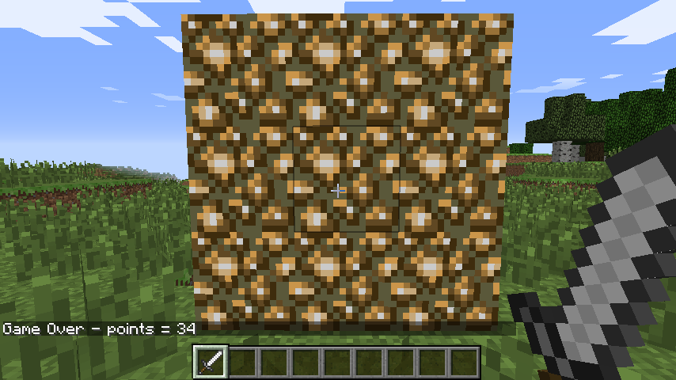

# Minecraft Whack A Block

Minecraft is one of the World's most popular open-world building games.
A free version of Minecraft is available for the Raspberry Pi; it also comes with a programming interface. This means you can write commands and scripts in Python code to build things in the game automatically. It's a great way to learn Python!

## Whack-a-Block

The game you are going to create is called "Whack-a-Block", inspired by the original arcade game ["Whac-a-Mole"](http://en.wikipedia.org/wiki/Whac-A-Mole). The objective of the game is to whack (or hit with a sword) the blocks that light up as glowstone, and turn them back to stone. You will earn points for each block you turn back to stone and the game is over when all the blocks have been turned into glowstone.

To create this game you're going to need to use Minecraft Pi Edition on the Raspberry Pi, and the Python 3 programming environment IDLE.

[[[idle-opening]]]

[[[minecraft-opening]]]

[[[minecraft-testing]]]

## Build a Whack-A-Block game board

1.  You can now begin creating your game. You can start with a fresh new Python script. Save it as `whac_a_block.py`

1.  Next you want to import the neccessary module and create a connection to Minecraft

~~~ python
from mcpi.minecraft import Minecraft

mc = Minecraft.create()
~~~

1.  To begin with you're going to need to know Steve's position in the game. If you don't know how to do this, then you can use the section below, or skip forward if you already know how to do this.

[[[minecraft-steves-position]]]

1.  Now that you know how to get Steve's position, you can begin your program by storing his poition as three variables. You can use `px`, `py`, and `pz`

~~~ python
px, py, pz = mc.player.getPos()
~~~

## Representing the game board

You can represent the game board using a two-dimensional list. If you've never used 2d lists before then check out the section below, or skip to the next section if you are familiar with them.

[[[python-2d-lists]]]

1.  The game board for Whac-A-Block is going to be a 3x3 grid of blocks. This is most easily represented by a 2d list. The rows within the list can contain the minecraft block values. In this case you can use `1` to represent a Stone block.

	~~~ python
	board = [[1, 1, 1],
			 [1, 1, 1],
			 [1, 1, 1]]
	~~~

1.  Now you can create a function to draw the board. Have a look at the sections below on how to use the `enumerate` function in Python and how to set a block in Minecraft, and then have a go at the challenge.

[[[python-enumerate]]]

[[[minecraft-set-block]]]

### Challenge

Create a function called `draw_board`, that takes no arguments. In the function you will need two nested `for` loops to `enumerate` through the 2d board list.
The loops should set blocks, 3 spaces away from the player's `z` position, and a number of spaces away from the player's `x` and `y` postion equal to the indices in the list. The block should correspond to the values in the lists.

So for instance:
- the first block would be placed 0 spaces away from the player on both `x` and `y`.
- the second block would be placed 1 spaces away from the player on the `x` and 0 spaces away on the `y`
- the third block would be placed 2 spaces away from the player on the `x` and 0 spaces away on the `y`
- the fourth block would be placed 0 spaces away from the player on the `x` and 1 space away on the `y`

### Hint 1
{: .hint-heading #hint-1 }
Here's what the code would look like in structured English.  
1. Define the function `draw_board`  
2. Enumerate over each row in the `board`  
3. Enumerate over each block in the `row`  
4. Set a block adding the index of the block to Steve's `px` position, and the index of the row to Steve's `py` position. You should always add 3 to Steve's `pz` position.
{: .hint-content .hint-1 }

### Hint 2
{: .hint-heading #hint-2 }
To enumerate over the board, your first `for` loop would look something like this:  
~~~ python
for y, row in enumerate(board):
~~~
{: .hint-content .hint-2 }

### Hint 3
{: .hint-heading #hint-3 }
Your final line within the nested `for` loops should look something like this:  
~~~ python
mc.setBlock(px+x, py+y, pz + 3, block)
~~~
{: .hint-content .hint-3 }

### Hint 4
{: .hint-heading #hint-4 }
Have a look at this video of the code being written and run if you are completely stuck.  

{: .hint-content .hint-4}

## Switching a random block

1.  The next stage is to add in the **mole** from the original game, which in your case is going to be a block of `glowstone`. Glowstone has an id of 89.

1.  Change any of the items in the `board` 2d list to the number 89.

	~~~ python
	board = [[1, 1, 1],
			 [1, 89, 1],
			 [1, 1, 1]]
	~~~

1.  Now if you run your script again and call the `draw_board()` function in the shell, you should see a block of glowstone appearing in the board.

1.  To make the glowstone appear anywhere in the board, you just need to shuffle the lists. This way the `89` can appear anywhere.

1.  If you don't know how to shuffle lists, have a look at the section below. If you already know about shuffling, you can skip to the challenge.

[[[python-sort-shuffle-lists]]]

## Challenge

Define a function called `pop_up()` that takes no arguments. Within the function, shuffle each row of the `board` list, and then shuffle the `board` itself. Once this has been completed, call the `draw_board()` function.

### Hint 1
{: .hint-heading #hint-5 }
1. First you'll need to use a `for` loop to iterate through `board` and shuffle each row.  
2. Then you can shuffle the board.  
3. Lastly you can call the `draw_board` function.  
{: .hint-content .hint-5 }

### Hint 2
{: .hint-heading #hint-6 }
To shuffle the board you can use the line:  
~~~ python
shuffle(board)
~~~
{: .hint-content .hint-6 }

### Hint 3
{: .hint-heading #hint-7 }
To shuffle each row you can use a `for` loop.  
~~~ python
for row in board:
    shuffle(row)
~~~
{: .hint-content .hint-7 }

### Hint 4
{: .hint-heading #hint-8 }
Have a look at the video below to see the function being written.  
{: .hint-content .hint-8 }

## Getting the player ready

Now that you have a gameboard for the player to use, you need to create the logic for the game itself.

1.  To give the player a warning that the game is about to start, post a couple of messages to the chat window and put a delay into the program using `sleep(seconds)`. The following code can be placed into your program after the initial gameboard has been created.

	~~~ python
	mc.postToChat("Get ready ...")
	sleep(2)
	mc.postToChat("Go")
	~~~

1.  Run the program again. You should see the game board appear directly in front of the player, and the messages "Get ready ..." and "Go".

## Turn the blocks on

To begin the next part of the program, you'll need to create two new variables and set them both to the value of `0`. `blocks_lit` stores the number of blocks that have been "lit-up". `points` will store the number of blocks that the player has managed to hit.

~~~ python
blocks_lit = 0
points = 0
~~~

You now need to write your main game loop. To start off with, you'll need to know a little bit about how you can generate random numbers in Python. Skip down to the section below, if you are already familiar with this.

[[[python-random]]]

### Challenge

You can being your main loop by making a random block change from stone to glowstone.
1. Use a `while` loop that continues so long as `blocks_lit` is less than 9
2. Within the loop, 

	Create a `while` loop which will continue until the `blocks_lit` variable is 9 (i.e. all the blocks are turned to glowstone). Next, put a small delay of 0.2 seconds into the program; otherwise it will run so fast, you won't be able to whack any blocks!

	From now on, the code will be indented under this `while` loop.

1.  The next step is to randomly turn a block into glowstone. This is more difficult than it sounds: what happens if the block you randomly choose is already glowstone? Your code needs to be able to deal with this. 

	The method you will use is a really simple one. The code creates a random position, checks to see if that block is stone, and if it isn't (i.e. it's glowstone), it tries again and creates a new random position. The code will continue to do this until it finds a block which is still unlit.

	Create a variable called `lightCreated` then set it to `False`; next, create a `while` loop which will continue until `lightCreated` is set to `True`. You should also increase the number of `blocks_lit` by 1, to show that another block will be lit:

	~~~ python
		blocks_lit = blocks_lit + 1
		lightCreated = False
		while not lightCreated:
	~~~

	Once a block is successfully turned to glowstone, `lightCreated` will be set to `True` and the loop will exit. 

1.  Inside this loop use `randint(start, end)` to create a random `x` (between -1 and 1) and `y` (between 0 and 2) position on the game board:  

	~~~ python
			xPos = pos.x + randint(-1,1)
			yPos = pos.y + randint(0,2)
			zPos = pos.z + 3
	~~~

	

1.  Use `getBlock(x,y,z)` and an `if` statement to check if the block at the random position is STONE. If it is, set it to glowstone using `setBlock(x,y,z,blockId)` and make `lightCreated = True`; if this is not changed, the code will go back to the start of the loop and find another random position.

	~~~ python
			if mc.getBlock(xPos, yPos, zPos) == 1:
				mc.setBlock(xPos, yPos, zPos, 89)
				lightCreated = True
	~~~

	**Note**: Rather than using the ID numbers of blocks (e.g. stone = 1, glowstone = 89), you can use the `block` module, which holds all the block IDs and their names (e.g. `1`).

1.  Run the program by clicking `Run > Run Module` in IDLE or by pressing F5; you should see the game board appear. The stone blocks should then, one by one, turn into glowstone and the program should end when all nine are lit.

## Whack blocks

The player will whack blocks by hitting them (right-clicking) while holding a sword. The Minecraft API has functions which allow you to find out what blocks were hit; these are known as block hit *events*. Using the function `events.pollBlockHits()` you can get a list of the events that have occurred since it was last called, such as blocks which were hit.

You will use events to find out the position of the block which was hit, before using `getBlock(x,y,z)` to see if the block hit was glowstone. If it was, you will then use `setBlock(x,y,z,blockId)` to turn it back to stone, before reducing the number of blocks lit and increasing the player's score.

1.  Indented under the `while blocks_lit < 9` loop, create the following code to loop through the block hit events list:

	~~~ python
		for hitBlock in mc.events.pollBlockHits():
	~~~

	**Note**: The `hitBlock` variable holds the *event* which has happened. It contains lots of information, including which block was hit, what face was hit and who hit it. You can see this information in the Python shell by using `print hitBlock`.

1.  Use `getBlock(x,y,z)`, the `hitBlock` event data and an `if` statement to see if the block hit was glowstone. If it was, use `setBlock(x,y,z,blockId)` to set it back to stone before reducing the `blocks_lit` variable and adding 1 to the player's `points`:

	~~~ python
			if mc.getBlock(hitBlock.pos.x, hitBlock.pos.y, hitBlock.pos.z) == 89:
				mc.setBlock(hitBlock.pos.x, hitBlock.pos.y, hitBlock.pos.z, 1)
				blocks_lit = blocks_lit - 1
				points = points + 1 
	~~~

1.  Run the program. The game board should appear and this time when the blocks are lit, if you hit them by right-clicking with a sword, they should turn off.

## Game over

The last step in the game is to let the player know it's "Game Over" and to tell them how many points they scored. The very last line of the program should be:

~~~ python
mc.postToChat("Game Over - points = " + str(points))
~~~

